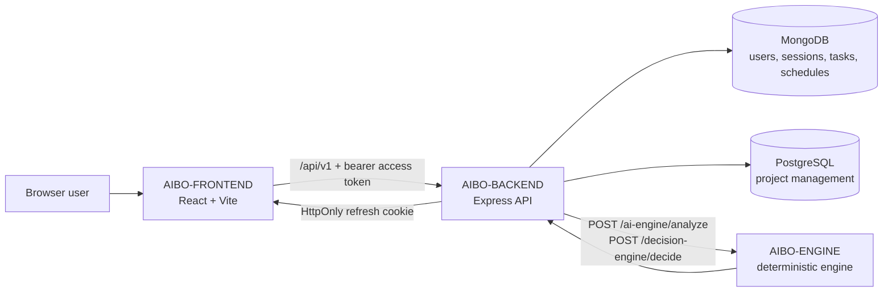

# AIBO Engineering Governance

This repository is the engineering operating system for the AIBO Assistant ecosystem. It defines the shared standards, documentation architecture, workflow rules, templates, CI/CD governance, and operational expectations used by:

- `AIBO-BACKEND`
- `AIBO-FRONTEND`
- `AIBO-ENGINE`
- this `.github` governance repository

AIBO Assistant is a productivity platform that combines task management, scheduling, project management, and a deterministic intent-processing engine. The current system is not a mature autonomous AI product. The backend is the strongest implementation area, the frontend is an early application scaffold with auth flow work, and the engine is a rule-based prototype with stable contracts that can evolve into stronger AI capabilities later.

## Current Implementation Status

| Area | Current state | Notes |
| --- | --- | --- |
| Backend API | Implemented / partial | Express API with auth, users, tasks, schedules, projects, engine classification integration, validation, logging, rate limiting, MongoDB, and PostgreSQL support. |
| Frontend | Partial | React/Vite app with routing, auth lifecycle helpers, API client, login/signup/admin login pages, protected dashboard route, and limited feature UI. |
| AI engine | Prototype | Python deterministic intent classification, entity extraction, decision routing, pipeline schemas, FastAPI transport, and tests. No LLM/OpenAI integration is implemented. |
| CI/CD | Planned foundation | This repository now defines reusable workflow patterns and governance, but service repositories must opt in and wire their checks. |
| Deployment | Not implemented | No production deployment target is claimed. Deployment docs define readiness rules and placeholders only. |
| Observability | Partial / planned | Backend has structured logging and request IDs. Metrics, tracing, dashboards, and alerting are roadmap items. |
| Security governance | Baseline | Backend has auth/session hardening and validation. Formal vulnerability process, secret rotation, and production controls still need operational adoption. |

See the full [feature maturity matrix](docs/product/feature-maturity-matrix.md) before making product, roadmap, or release claims.

## Repository Ecosystem

| Repository | Ownership | Primary responsibilities |
| --- | --- | --- |
| `.github` | Engineering governance | Shared standards, community health files, templates, ADR process, architecture docs, CI/CD policy, security policy, onboarding, and operational standards. |
| `AIBO-BACKEND` | Platform/API | HTTP API, authentication, session lifecycle, validation, persistence, backend orchestration, OpenAPI source, and service-to-engine integration. |
| `AIBO-FRONTEND` | Web experience | Browser UI, route composition, auth lifecycle, API client behavior, user workflows, accessibility, and frontend state boundaries. |
| `AIBO-ENGINE` | AI domain layer | Deterministic intent classification, entity extraction, routing, engine schemas, and local transport adapter. |

Detailed boundaries are documented in [architecture/service-boundaries.md](architecture/service-boundaries.md) and [architecture/repository-relationships.md](architecture/repository-relationships.md).

## Architecture Summary

Primary architecture references:

- [High-level architecture](architecture/overview.md)
- [Request lifecycle](architecture/request-lifecycle.md)
- [Auth lifecycle](architecture/auth-lifecycle.md)
- [AI lifecycle](architecture/ai-lifecycle.md)
- [Scheduler lifecycle](architecture/scheduler-lifecycle.md)
- [Deployment topology](architecture/deployment-topology.md)
- [Database ownership](architecture/database-ownership.md)
- [Scalability strategy](architecture/scalability-strategy.md)
- [Mermaid diagram sources](diagrams/README.md)

## Feature Maturity Snapshot

| Capability | Status |
| --- | --- |
| Backend auth and browser refresh session model | Implemented |
| Backend task, schedule, and project APIs | Implemented / partial |
| Frontend auth lifecycle and API client | Partial |
| Frontend complete task/schedule/project experience | Planned |
| Engine deterministic classification and routing | Prototype |
| OpenAI or LLM integration | Planned, not implemented |
| CI/CD enforcement | Planned foundation |
| Production deployment | Not implemented |
| Centralized observability | Planned |

The canonical matrix is [docs/product/feature-maturity-matrix.md](docs/product/feature-maturity-matrix.md).

## Technology Stack

| Layer | Current technology |
| --- | --- |
| Frontend | React, Vite, React Router, Axios, ESLint, Prettier |
| Backend | Node.js 22+, Express, Zod, Mongoose, PostgreSQL `pg`, JWT, Helmet, Pino, Jest, Supertest |
| Engine | Python, FastAPI transport, Pydantic schemas, deterministic rule-based classification and extraction |
| Data stores | MongoDB for users/sessions/tasks/schedules; PostgreSQL for project management |
| API documentation | `AIBO-BACKEND/docs/openapi.yaml` is the current OpenAPI source |
| Tooling | GitHub, npm, Node test runner, Jest, Python unittest, Postman collections |

Not implemented today: Redis caching, OpenAI/LLM integration, production infrastructure automation, centralized metrics/tracing, mobile application, external calendar integration, and automated release deployment.

## Documentation Map

| Need | Start here |
| --- | --- |
| Product scope and roadmap | [docs/product/vision.md](docs/product/vision.md), [ROADMAP.md](ROADMAP.md) |
| Architecture | [architecture/overview.md](architecture/overview.md) |
| Engineering standards | [standards/engineering-principles.md](standards/engineering-principles.md) |
| Contribution process | [CONTRIBUTING.md](CONTRIBUTING.md) |
| API rules | [api-governance/README.md](api-governance/README.md) |
| Security | [SECURITY.md](SECURITY.md), [security/security-governance.md](security/security-governance.md) |
| Deployment readiness | [deployment/deployment-strategy.md](deployment/deployment-strategy.md) |
| Observability | [observability/monitoring-strategy.md](observability/monitoring-strategy.md) |
| Onboarding | [onboarding/README.md](onboarding/README.md) |
| ADRs | [adr/README.md](adr/README.md) |

## Local Setup Entry Points

Use the service repository README files for repository-specific commands, and use this repository for the cross-repo setup order.

1. Read [onboarding/local-setup.md](onboarding/local-setup.md).
2. Configure backend environment from [onboarding/environment-setup.md](onboarding/environment-setup.md).
3. Start `AIBO-ENGINE` locally when testing intent classification.
4. Start `AIBO-BACKEND` with MongoDB and PostgreSQL available.
5. Start `AIBO-FRONTEND`; Vite proxies `/api` to the backend during local development.

## Workflow Overview

Every change should follow the same governance flow:

1. Create a scoped issue or task using the templates in [ISSUE_TEMPLATE](ISSUE_TEMPLATE).
2. Create a branch that follows [standards/branching-strategy.md](standards/branching-strategy.md).
3. Keep the change small enough to review.
4. Run the service-specific lint/test/build checks.
5. Open a pull request using [PULL_REQUEST_TEMPLATE.md](PULL_REQUEST_TEMPLATE.md).
6. Document architecture, API, security, or operational impact when applicable.
7. Merge only after required review and validation evidence are complete.

## CI/CD Governance

The service repositories do not yet have a fully implemented production CI/CD system. This repository provides:

- reusable workflow foundations under [.github/workflows](.github/workflows)
- branch protection recommendations in [workflows/branch-protection.md](workflows/branch-protection.md)
- CI/CD governance in [workflows/ci-cd-governance.md](workflows/ci-cd-governance.md)
- release rules in [workflows/release-governance.md](workflows/release-governance.md)
- changelog automation strategy in [workflows/changelog-automation.md](workflows/changelog-automation.md)

Deployment workflows are intentionally placeholders until real environments, secrets, approvals, and rollback paths are defined.

## Security Overview

Current backend security foundations include JWT access tokens, HttpOnly refresh-cookie sessions, refresh rotation, validation, rate limiting, Helmet, request IDs, structured logging, and redaction utilities. Required governance is defined in:

- [SECURITY.md](SECURITY.md)
- [security/secrets-management.md](security/secrets-management.md)
- [security/auth-token-policy.md](security/auth-token-policy.md)
- [security/logging-redaction.md](security/logging-redaction.md)
- [security/production-safety.md](security/production-safety.md)

Security issues must not be opened as public issues unless they are already disclosed and non-sensitive.

## AI Architecture Overview

The engine is currently deterministic. It classifies supported intents, extracts entities, routes to action types, and returns structured schema-backed output. It does not call OpenAI or any hosted LLM. Future AI maturity work must add evaluation, safety boundaries, observability, fallback behavior, and explicit confidence thresholds before production automation.

Start with [docs/ai-engine/intent-classification.md](docs/ai-engine/intent-classification.md) and [docs/ai-engine/evaluation-strategy.md](docs/ai-engine/evaluation-strategy.md).

## Ownership

The `.github` repository owns shared governance, not service implementation. Service repositories own their runtime code, tests, and service-specific docs. Cross-repo contracts must be documented here and implemented in the service repos.

Ownership rules are defined in [standards/repository-ownership.md](standards/repository-ownership.md).

## License

The ecosystem license is not finalized. The backend package currently declares `ISC`, but that does not establish an approved ecosystem-wide license. See [LICENSE](LICENSE) for the current repository notice and resolve licensing before public distribution or external contribution expansion.

## Support

Use [SUPPORT.md](SUPPORT.md) for support paths, maintenance expectations, and escalation rules.
