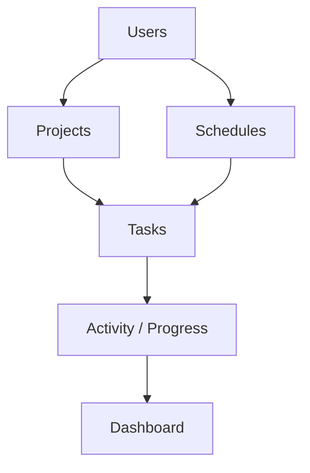

# Architecture Documentation

This directory is the canonical architecture source for the AIBO ecosystem.

## Start Here

- [Overview](overview.md)
- [Repository relationships](repository-relationships.md)
- [Service boundaries](service-boundaries.md)
- [Request lifecycle](request-lifecycle.md)
- [Auth lifecycle](auth-lifecycle.md)
- [AI lifecycle](ai-lifecycle.md)
- [Scheduler lifecycle](scheduler-lifecycle.md)
- [Deployment topology](deployment-topology.md)
- [Database ownership](database-ownership.md)
- [Database schema](database-schema.md)
- [Database redesign](database-redesign.md)
- [Scalability strategy](scalability-strategy.md)
- [Future state](future-state.md)

## High-Level Flow

## Architecture Rules

- Service boundaries must be explicit.
- Cross-repo contracts must be versioned or documented before implementation.
- Database ownership must not be changed casually.
- New infrastructure requires an ADR and an operational owner.
- Diagrams must distinguish current state from future state.
