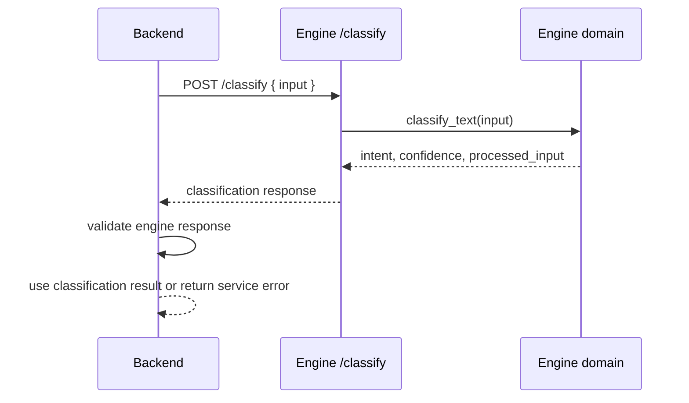

# AI Lifecycle

The current AI layer is deterministic, not provider-backed LLM intelligence.

## Current Capabilities

- Supported intents include task creation, scheduling, project, and unknown.
- Engine returns confidence between `0` and `1`.
- Unknown or ambiguous input should result in clarification behavior in the richer pipeline.
- Backend validates engine response shape before returning classification.

## Future AI Requirements

Any future LLM or external AI provider must include:

- ADR approval.
- provider isolation behind engine contracts.
- evaluation data and regression thresholds.
- confidence and fallback policy.
- observability for latency, error rate, and classification distribution.
- redaction rules for prompts and logs.
- explicit user confirmation for risky mutations.
