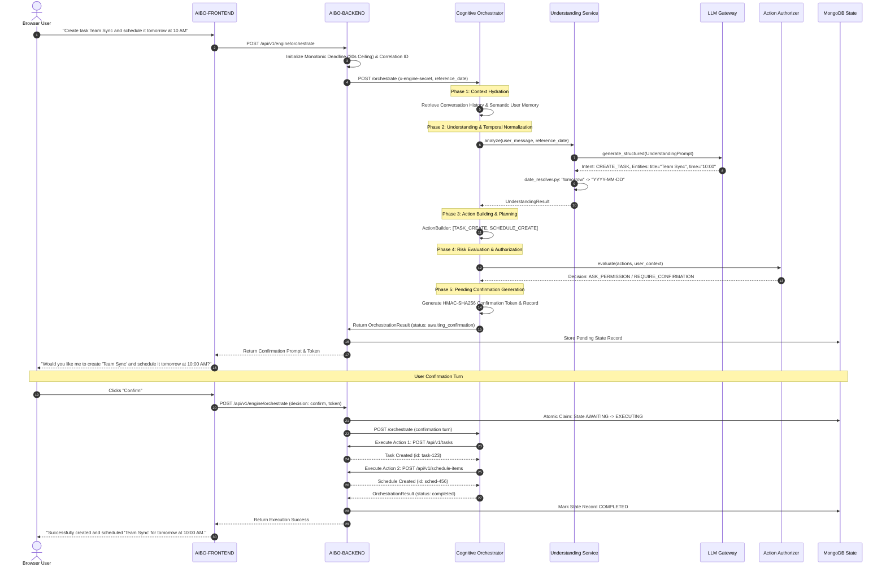

# AIBO Assistant — Cognitive AI Lifecycle

This document describes the canonical end-to-end cognitive request lifecycle in `AIBO-ENGINE-V1.0`, from natural language ingress to authorized, truthful action execution.

---

## 1. Cognitive Architecture Overview

The cognitive subsystem is structured into modular, decoupled services:

```
┌─────────────────────────────────────────────────────────────────────────────┐
│                            AIBO-ENGINE-V1.0                                 │
│                                                                             │
│  ┌───────────────────────┐         ┌─────────────────────────────────────┐  │
│  │ Understanding Service │         │            Planning Service         │  │
│  │ - Intent Classifier   │         │ - Goal Analyzer                     │  │
│  │ - Entity Extractor    │───────► │ - Action Builder                    │  │
│  │ - Date Resolver       │         │ - Project & Task Decomposer         │  │
│  └───────────────────────┘         └──────────────────┬──────────────────┘  │
│                                                       │                     │
│                                                       ▼                     │
│  ┌───────────────────────┐         ┌─────────────────────────────────────┐  │
│  │  State & Memory Store │         │          Action Authorizer          │  │
│  │ - Session State       │         │ - Risk Assessment (Low/Med/High)    │  │
│  │ - Cognitive Memory    │         │ - Policy Engine                     │  │
│  │ - Pending Confirmations◄────────┤   (Auto / Ask / Require Confirm)    │  │
│  └───────────────────────┘         └──────────────────┬──────────────────┘  │
│                                                       │                     │
│                                                       ▼                     │
│  ┌───────────────────────┐         ┌─────────────────────────────────────┐  │
│  │   LLM Gateway Router  │         │          Execution Engine           │  │
│  │ - Gemini 3.6 Flash    │         │ - Backend Client Callbacks          │  │
│  │ - OpenAI GPT-4o-mini  │         │ - Conflict & Overlap Detection      │  │
│  │ - Ollama Qwen2.5:7b   │         │ - Idempotency & Rollback Guards     │  │
│  │ - Circuit Breakers    │         └─────────────────────────────────────┘  │
│  └───────────────────────┘                                                  │
└─────────────────────────────────────────────────────────────────────────────┘
```

---

## 2. End-to-End Orchestration Sequence


```mermaid
sequenceDiagram
  autonumber
  actor User as Browser User
  participant FE as AIBO-FRONTEND
  participant BE as AIBO-BACKEND
  participant ORCH as Cognitive Orchestrator
  participant NLU as Understanding Service
  participant LLM as LLM Gateway
  participant AUTH as Action Authorizer
  participant MONGO as MongoDB State

  User->>FE: "Create task Team Sync and schedule it tomorrow at 10 AM"
  FE->>BE: POST /api/v1/engine/orchestrate
  BE->>BE: Initialize Monotonic Deadline (30s Ceiling) & Correlation ID
  BE->>ORCH: POST /orchestrate (x-engine-secret, reference_date)

  Note over ORCH: Phase 1: Context Hydration
  ORCH->>ORCH: Retrieve Conversation History & Semantic User Memory

  Note over ORCH: Phase 2: Understanding & Temporal Normalization
  ORCH->>NLU: analyze(user_message, reference_date)
  NLU->>LLM: generate_structured(UnderstandingPrompt)
  LLM-->>NLU: Intent: CREATE_TASK, Entities: title="Team Sync", time="10:00"
  NLU->>NLU: date_resolver.py: "tomorrow" -> "YYYY-MM-DD"
  NLU-->>ORCH: UnderstandingResult

  Note over ORCH: Phase 3: Action Building & Planning
  ORCH->>ORCH: ActionBuilder: [TASK_CREATE, SCHEDULE_CREATE]

  Note over ORCH: Phase 4: Risk Evaluation & Authorization
  ORCH->>AUTH: evaluate(actions, user_context)
  AUTH-->>ORCH: Decision: ASK_PERMISSION / REQUIRE_CONFIRMATION

  Note over ORCH: Phase 5: Pending Confirmation Generation
  ORCH->>ORCH: Generate HMAC-SHA256 Confirmation Token & Record
  ORCH->>BE: Return OrchestrationResult (status: awaiting_confirmation)
  BE->>MONGO: Store Pending State Record
  BE-->>FE: Return Confirmation Prompt & Token
  FE-->>User: "Would you like me to create 'Team Sync' and schedule it tomorrow at 10:00 AM?"

  Note over User, MONGO: User Confirmation Turn
  User->>FE: Clicks "Confirm"
  FE->>BE: POST /api/v1/engine/orchestrate (decision: confirm, token)
  BE->>MONGO: Atomic Claim: State AWAITING -> EXECUTING
  BE->>ORCH: POST /orchestrate (confirmation turn)
  ORCH->>BE: Execute Action 1: POST /api/v1/tasks
  BE-->>ORCH: Task Created (id: task-123)
  ORCH->>BE: Execute Action 2: POST /api/v1/schedule-items
  BE-->>ORCH: Schedule Created (id: sched-456)
  ORCH-->>BE: OrchestrationResult (status: completed)
  BE->>MONGO: Mark State Record COMPLETED
  BE-->>FE: Return Execution Success
  FE-->>User: "Successfully created and scheduled 'Team Sync' for tomorrow at 10:00 AM."
```

---

## 3. Cognitive Governance & Safeguards

### 3.1 Temporal Reference Anchoring
All relative temporal phrases ("today", "tomorrow", "next Monday", "in 2 hours") are deterministically resolved by `src/cognitive/understanding/date_resolver.py` anchored strictly to the client-supplied `reference_date`. This guarantees 100% reproducible scheduling behavior across timezones and prevents date drift during multi-turn confirmation dialogues.

### 3.2 Multi-Provider LLM Gateway
The LLM gateway provides unified model access with enterprise reliability controls:
- **Primary Provider**: Google Gemini (`gemini-3.6-flash`).
- **Fallback Provider**: OpenAI (`gpt-4o-mini`).
- **Local Offline Provider**: Ollama (`qwen2.5:7b`).
- **Deterministic Mock Provider**: Used for zero-cost, reproducible CI and E2E testing.
- **Circuit Breaker**: Detects provider rate limits (HTTP 429) or outages (HTTP 503) and shifts traffic to fallbacks without crashing the user request.
- **Deadline-Aware Retries**: Retries are only attempted if sufficient time remains in the monotonic deadline budget.

### 3.3 Authorization Policies & Risk Matrix
Every proposed action is classified by `ActionAuthorizer`:
- **Low Risk (`AUTO_EXECUTE`)**: Read-only queries, preference updates, non-destructive notifications.
- **Medium Risk (`ASK_PERMISSION`)**: New task creation, calendar scheduling.
- **High Risk (`REQUIRE_CONFIRMATION`)**: Task deletion, schedule cancellation, bulk updates, project board deletion.

High-risk actions require explicit, tokenized user confirmation before any database mutations are permitted.
