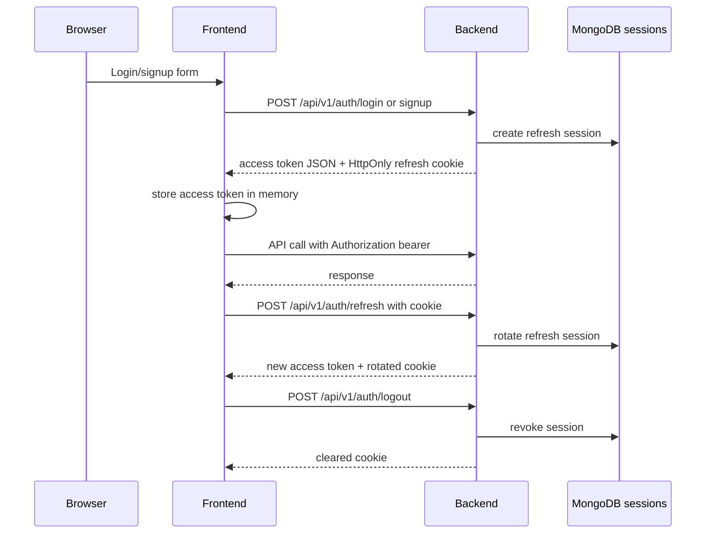

# Auth Lifecycle

## Implemented Rules

- Refresh token is stored in an HttpOnly cookie for browser clients.
- Access token is returned in JSON and stored in frontend memory.
- Refresh and logout require browser client expectations.
- Backend rotates refresh sessions and revokes logout sessions.
- Frontend clears local auth state on auth failure.

## Required Controls

- Production must use HTTPS.
- `AUTH_COOKIE_SAME_SITE=none` requires `AUTH_COOKIE_SECURE=true`.
- Wildcard CORS is not allowed in production.
- Refresh tokens must not be accepted from browser request bodies.
- Logs must redact cookies, tokens, authorization headers, and session secrets.
