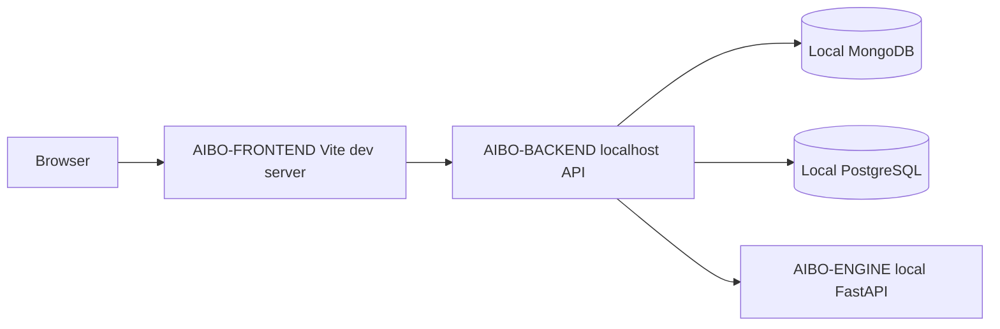

# Deployment Topology

No production deployment topology is implemented today. This document defines the target shape that deployment work must make real before production claims are allowed.

## Current Local Topology

## Future Production Topology Requirements

- HTTPS termination.
- Frontend static hosting or application hosting.
- Backend service runtime with health checks.
- Engine service runtime with health checks.
- Managed MongoDB or equivalent replica-set capable deployment.
- Managed PostgreSQL with migrations and backup policy.
- Secret manager or platform-native secret storage.
- Central logging before production launch.
- Metrics and alerting before production launch.

## Not Yet Decided

- Hosting provider.
- Container strategy.
- Network layout.
- Deployment approval model.
- Rollback automation.
- Backup tooling.
