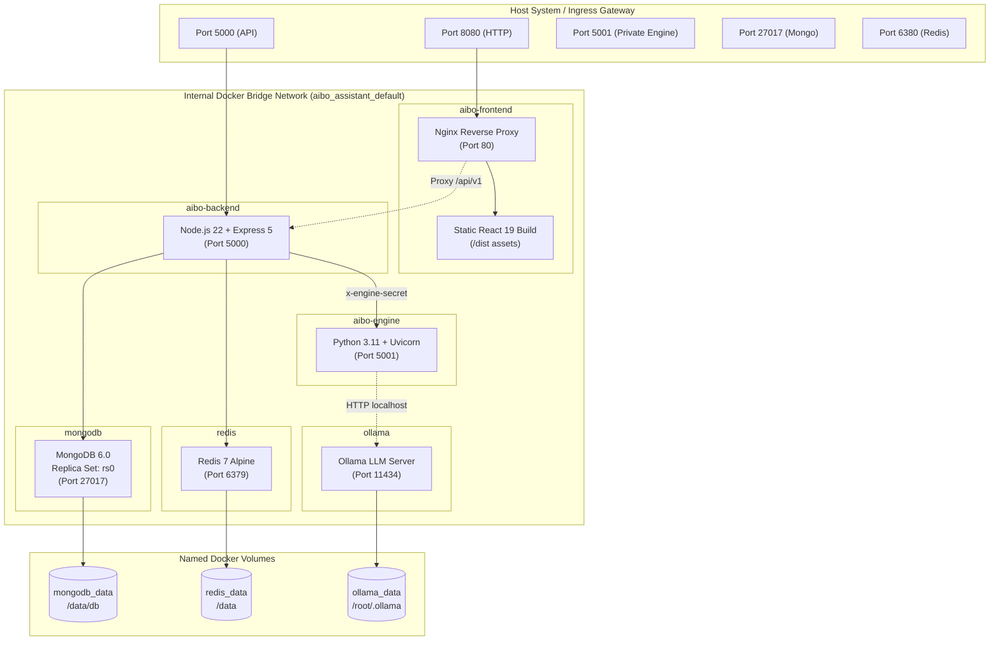

# AIBO Assistant — Deployment Topology & Container Architecture

This document describes the multi-container production deployment architecture, network topology, container specifications, and volume persistency for AIBO V1.0.

---

## 1. Multi-Container Deployment Diagram


```mermaid
flowchart TB
  subgraph PublicHost ["Host System / Ingress Gateway"]
    Port8080["Port 8080 (HTTP)"]
    Port5000["Port 5000 (API)"]
    Port5001["Port 5001 (Private Engine)"]
    Port27017["Port 27017 (Mongo)"]
    Port6380["Port 6380 (Redis)"]
  end

  subgraph DockerNetwork ["Internal Docker Bridge Network (aibo_assistant_default)"]
    subgraph FrontendService ["aibo-frontend"]
      Nginx["Nginx Reverse Proxy<br/>(Port 80)"]
      SPA["Static React 19 Build<br/>(/dist assets)"]
    end

    subgraph BackendService ["aibo-backend"]
      Express["Node.js 22 + Express 5<br/>(Port 5000)"]
    end

    subgraph EngineService ["aibo-engine"]
      FastAPI["Python 3.11 + Uvicorn<br/>(Port 5001)"]
    end

    subgraph DBService ["mongodb"]
      MongoD["MongoDB 6.0<br/>Replica Set: rs0<br/>(Port 27017)"]
    end

    subgraph CacheService ["redis"]
      RedisD["Redis 7 Alpine<br/>(Port 6379)"]
    end

    subgraph LocalLLMService ["ollama"]
      OllamaD["Ollama LLM Server<br/>(Port 11434)"]
    end
  end

  subgraph PersistentStorage ["Named Docker Volumes"]
    MongoVol[("mongodb_data<br/>/data/db")]
    RedisVol[("redis_data<br/>/data")]
    OllamaVol[("ollama_data<br/>/root/.ollama")]
  end

  Port8080 --> Nginx
  Nginx --> SPA
  Nginx -.->|Proxy /api/v1| Express

  Port5000 --> Express
  Express --> MongoD
  Express --> RedisD
  Express -->|x-engine-secret| FastAPI

  FastAPI -.->|HTTP localhost| OllamaD

  MongoD --> MongoVol
  RedisD --> RedisVol
  OllamaD --> OllamaVol
```

---

## 2. Service Catalog & Port Allocation

| Container Name | Service Role | Image / Context | Published Host Port | Internal Port | Healthcheck Probe |
| :--- | :--- | :--- | :---: | :---: | :--- |
| **`aibo-frontend`** | Web Client UI | Multi-stage build (`AIBO-FRONTEND/Dockerfile`) | `8080` | `80` | `wget -q --spider http://127.0.0.1:80` |
| **`aibo-backend`** | API & Orchestration | Node.js 22 Slim (`AIBO-BACKEND/Dockerfile`) | `5000` | `5000` | `GET /api/v1/health/ready` |
| **`aibo-engine`** | Cognitive AI Subsystem | Python 3.11 Slim (`AIBO-ENGINE-V1.0/Dockerfile`) | `5001` | `5001` | `GET /ready` (timeout 2s) |
| **`mongodb`** | Primary Persistence | `mongo:6` | `27017` | `27017` | `mongosh --port 27017 --eval "rs.status()"` |
| **`redis`** | Caching & Queues | `redis:7-alpine` | `6380` | `6379` | `redis-cli ping` |
| **`ollama`** | Local LLM Engine | `ollama/ollama:latest` | `11434` | `11434` | `ollama list` |

---

## 3. Dependency & Startup Ordering

To prevent startup races and premature connection failures, services enforce strict healthcheck dependencies:

1. **`mongodb`** starts, binds replica set `rs0`, and becomes healthy.
2. **`redis`** starts and passes `PING` health check.
3. **`ollama`** starts and loads local models.
4. **`aibo-engine`** waits for `ollama` health, initializes provider gateway, and signals `/ready`.
5. **`aibo-backend`** waits for `mongodb`, `redis`, and `aibo-engine` health, runs index synchronization, and listens on port 5000.
6. **`aibo-frontend`** waits for `aibo-backend` health and begins serving user traffic on port 8080.

---

## 4. Volume Persistency & Backup Strategy

- **`mongodb_data`**: Stores all collections, indexes, and write-ahead transaction logs. Backed up via `mongodump` snapshots.
- **`redis_data`**: Stores AOF / RDB persistence files for BullMQ job queue recovery across restarts.
- **`ollama_data`**: Stores downloaded local weights (`qwen2.5:7b`), eliminating redundant model downloads across container updates.

---

## 5. Deployment Commands & Operations

```powershell
# Validate Compose configuration syntax
docker compose config

# Build and start all services in background
docker compose up -d --build

# Follow combined logs
docker compose logs -f

# Verify container health status
docker compose ps
```

Detailed operational runbooks:
- [Production Deployment Runbook](../../docs/operations/V1.0_PRODUCTION_DEPLOYMENT_RUNBOOK.md)
- [Production Rollback Runbook](../../docs/operations/V1.0_PRODUCTION_ROLLBACK_RUNBOOK.md)
- [Incident Response Runbook](../../docs/operations/V1.0_INCIDENT_RUNBOOK.md)
