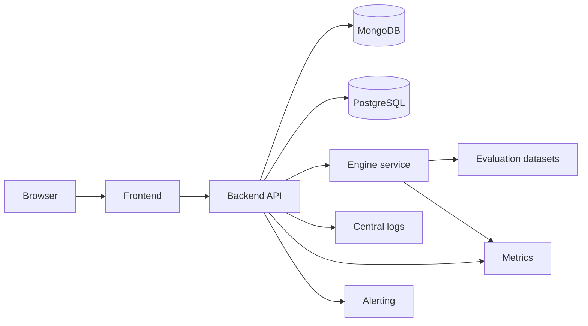

# Future-State Architecture

Future-state documentation is directional. It is not an implementation claim.

## Desired Future Properties

- All repositories have required CI.
- Deployment is automated but approval-gated.
- Backend and engine expose health checks.
- Logs, metrics, and traces are centralized.
- Engine quality is measured through versioned evaluation.
- API contracts are versioned and documented.
- Release notes and changelog are generated from disciplined commits and PR labels.

## Required Before Future-State Claims

- ADRs for infrastructure choices.
- Defined environment inventory.
- Secret management process.
- Rollback plan.
- Incident response process.
- Production readiness checklist per service.
