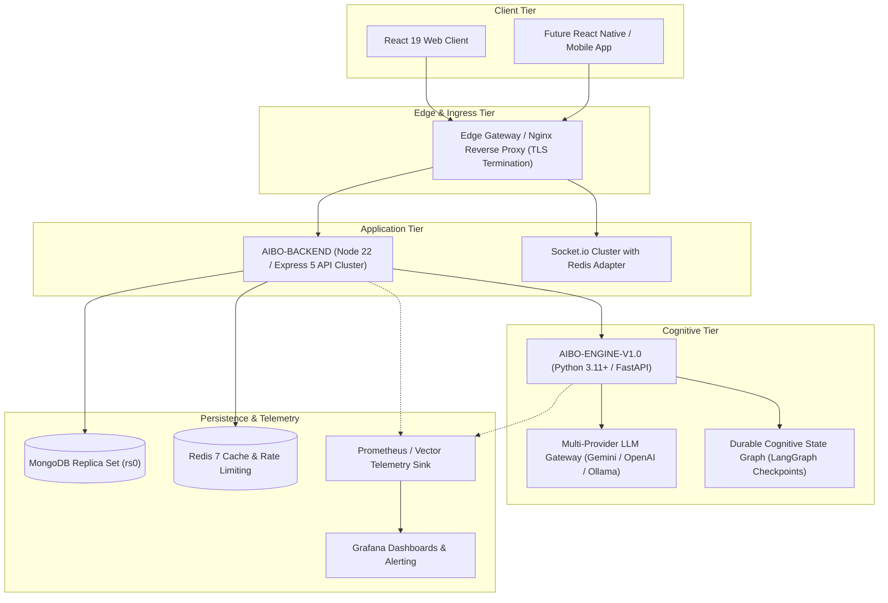

# Future-State Architecture

## Directional Evolution

This document outlines the architectural roadmap for AIBO Assistant beyond the V1.0 Release Candidate. Future architecture evolves incrementally based on observed production telemetry and real user needs.

---

## Architectural Topology: V1.x -> V2.0

```mermaid
flowchart TD
  subgraph Client Tier
    Browser["React 19 Web Client"]
    Mobile["Future React Native / Mobile App"]
  end

  subgraph Edge & Ingress Tier
    Ingress["Edge Gateway / Nginx Reverse Proxy (TLS Termination)"]
  end

  subgraph Application Tier
    Backend["AIBO-BACKEND (Node 22 / Express 5 API Cluster)"]
    SocketServer["Socket.io Cluster with Redis Adapter"]
  end

  subgraph Cognitive Tier
    Engine["AIBO-ENGINE-V1.0 (Python 3.11+ / FastAPI)"]
    Gateway["Multi-Provider LLM Gateway (Gemini / OpenAI / Ollama)"]
    StateStore["Durable Cognitive State Graph (LangGraph Checkpoints)"]
  end

  subgraph Persistence & Telemetry
    Mongo[("MongoDB Replica Set (rs0)")]
    RedisCache[("Redis 7 Cache & Rate Limiting")]
    Prometheus["Prometheus / Vector Telemetry Sink"]
    Grafana["Grafana Dashboards & Alerting"]
  end

  Browser --> Ingress
  Mobile --> Ingress
  Ingress --> Backend
  Ingress --> SocketServer
  Backend --> Mongo
  Backend --> RedisCache
  Backend --> Engine
  Engine --> Gateway
  Engine --> StateStore
  Backend -.-> Prometheus
  Engine -.-> Prometheus
  Prometheus --> Grafana
```

---

## Strategic Capabilities on the Horizon

1. **Centralized Telemetry Pipeline**: Transitioning from in-process bounded snapshots to Prometheus metric scraping and Grafana dashboard visualization.
2. **Multi-Tenant Workspace Isolation**: Enhanced organizational RBAC allowing cross-team project collaboration with granular permission matrices.
3. **Advanced Calendar Bi-Directional Sync**: Native Google Calendar and Microsoft Outlook synchronization with automated conflict detection.
4. **Voice & Multimodal Cognitive Nodes**: Streaming voice transcription and vision-augmented task creation powered by multimodal LLMs in `AIBO-ENGINE-V1.0`.
