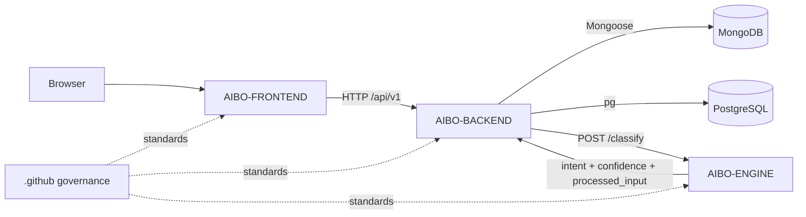

# High-Level Architecture

AIBO is split into three service repositories plus this governance repository.

## Current Runtime

- Frontend is a browser application built with React and Vite.
- Backend is the API boundary and owns persistence orchestration.
- Engine is a deterministic Python domain layer exposed through a small FastAPI transport.
- MongoDB and PostgreSQL are both used because current domain ownership differs by module.

## Key Architectural Choices

- Browser refresh tokens are HttpOnly cookies owned by the backend.
- Frontend stores access tokens in memory only.
- Backend owns API validation and authorization.
- Engine owns classification, extraction, routing, and schema normalization.
- Backend must validate engine responses before using them.

## Known Gaps

- Production deployment topology is not implemented.
- CI/CD enforcement is not wired into service repositories yet.
- Central metrics/tracing are not implemented.
- Frontend workflows do not yet cover all backend capabilities.
