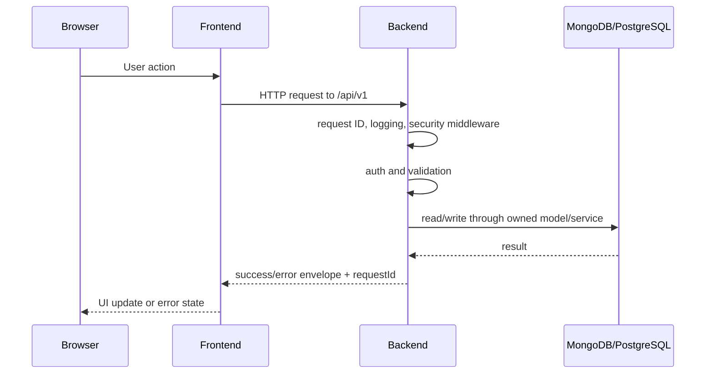

# Request Lifecycle

## Backend Request Rules

- Every response should include `requestId`.
- Validation failures must be structured.
- Authorization must happen before user-specific data access.
- Controllers should delegate business logic to services.
- Errors should be normalized through the global error handler.

## Frontend Request Rules

- Use the shared API client instead of raw Axios from components.
- Preserve `withCredentials` for browser refresh cookie behavior.
- Attach access tokens from memory only.
- Show recoverable errors without exposing internal details.
