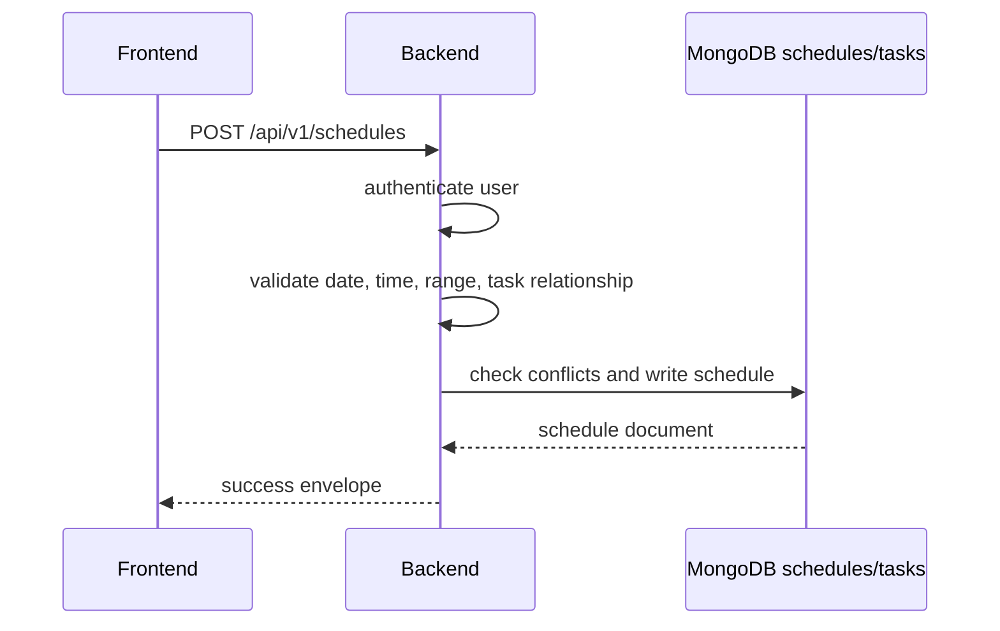

# Scheduler Lifecycle

The scheduler is currently a backend-owned workflow. The frontend schedule experience is not complete.

## Backend Responsibilities

- Validate schedule payloads.
- Prevent invalid time ranges.
- Handle conflict behavior consistently.
- Keep schedule writes scoped to the authenticated user.
- Preserve local development behavior when MongoDB transaction support is unavailable.

## Governance Requirements

- Any change to conflict semantics must update API docs and tests.
- Bulk schedule behavior must define partial failure semantics.
- Calendar integrations are planned only; do not document them as active.
