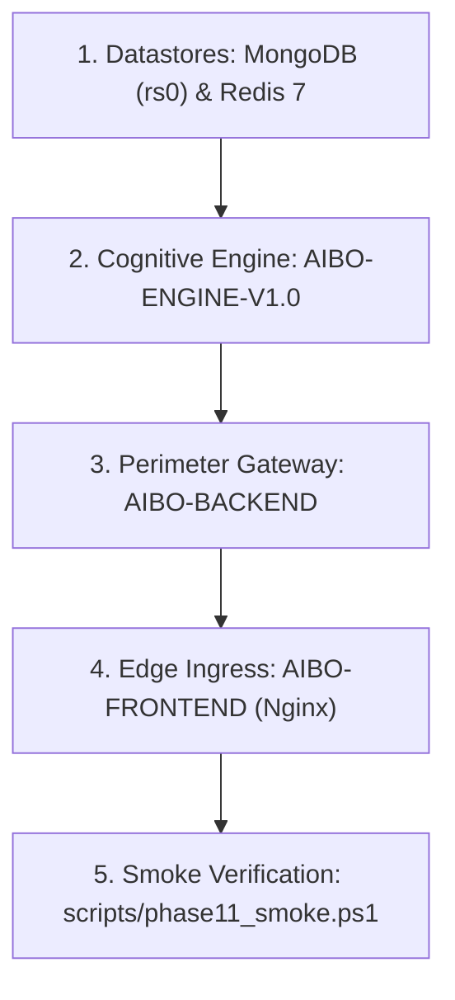

# Deployment Strategy

## Overview

AIBO Assistant V1.0 adopts a containerized, decoupled service architecture designed for reproducibility across local development, continuous integration, staging, and production environments.

The system topology is codified in the root [`docker-compose.yml`](file:///c:/Projects/AIBO_ASSISTANT/docker-compose.yml) and governed by operational runbooks located in [`docs/operations/`](file:///c:/Projects/AIBO_ASSISTANT/docs/operations/).

---

## Deployment Units & Topology

| Deployment Unit | Technology Stack | Exposed Port | Network Zone | Primary Responsibilities |
| --- | --- | --- | --- | --- |
| **`aibo-frontend`** | React 19, Vite 8, Nginx Alpine | `8080` (HTTP) | Public Perimeter | Serves optimized static SPA assets; reverse-proxies `/api/` to backend and handles WebSocket/Socket.io connections. |
| **`aibo-backend`** | Node.js 22+, Express 5, Mongoose | `5000` (Internal/Host) | Application Perimeter | Authenticates users, executes CRUD operations, validates domain logic, manages WebSocket broadcasts, acts as perimeter guard to engine. |
| **`aibo-engine`** | Python 3.11+, FastAPI, Uvicorn | `5001` (Internal Only) | Cognitive Core | Executes NLU intent classification, entity extraction, LangGraph cognitive state graph, LLM Gateway routing, and planning. Never exposed to public internet. |
| **`mongodb`** | MongoDB 7.0 Community (`rs0` Replica Set) | `27017` (Internal) | Persistence Layer | Authoritative persistent datastore for all domain entities (Users, Tasks, Projects, Columns, Schedules, Chat History, Confirmation Tokens). Multi-document ACID transactions enabled. |
| **`redis`** | Redis 7 Alpine | `6380` (Internal) | Cache & Rate Limiting | Session caching, distributed token-bucket rate limiting, ephemeral deduplication. |
| **`ollama`** *(Optional)* | Ollama LLM Container | `11434` (Internal) | AI Inference | Self-hosted local model provider for offline/air-gapped inference fallback. |

> [!IMPORTANT]
> **Single Datastore Architecture**: PostgreSQL has been entirely eliminated. All entity models reside within MongoDB using Mongoose schemas. Distributed cross-database transactions are strictly prohibited.

---

## Controlled Rollout Sequence

Deployments must follow a deterministic start order to ensure health checks pass before dependent services open traffic:

1. **Datastores Initialized**: MongoDB replica set (`rs0`) and Redis 7 start. Health probes (`mongosh ping`, `redis-cli ping`) must return 200 before dependents boot.
2. **Cognitive Engine Boots**: Python engine starts with durable state enabled. Verifies `/ready` and `/metrics` within the private container network. Circular dependencies to backend are avoided.
3. **Backend API Boots**: Express 5 backend connects to MongoDB and Redis, tests connection to Engine internal `/health`, and opens `/api/v1/health/ready`.
4. **Edge Ingress Boots**: Nginx front-door container starts, serving pre-rendered Vite bundles and proxying API calls to backend:5000.
5. **Preflight & Smoke Validation**: The automated preflight (`python scripts/phase11_preflight.py`) and smoke test (`scripts/phase11_smoke.ps1`) verify end-to-end user flows non-destructively.

---

## Operational Runbooks

Production operations are governed by dedicated runbooks in the repository:

- **[V1.0 Production Deployment Runbook](file:///c:/Projects/AIBO_ASSISTANT/docs/operations/V1.0_PRODUCTION_DEPLOYMENT_RUNBOOK.md)**: Preconditions, preflight checks, container builds, controlled rollout steps, and stop conditions.
- **[V1.0 Production Rollback Runbook](file:///c:/Projects/AIBO_ASSISTANT/docs/operations/V1.0_PRODUCTION_ROLLBACK_RUNBOOK.md)**: Instant recovery procedures, container rollbacks, and schema safety rules.
- **[V1.0 Canonical Rollout Runbook](file:///c:/Projects/AIBO_ASSISTANT/docs/operations/V1.0_CANONICAL_ROLLOUT_RUNBOOK.md)**: Transition plan from legacy endpoints to canonical `POST /orchestrate`.
- **[V1.0 Incident Runbook](file:///c:/Projects/AIBO_ASSISTANT/docs/operations/V1.0_INCIDENT_RUNBOOK.md)**: Triage, mitigation playbooks for provider outages, database degradation, and HMAC token validation failures.
- **[V1.0 Production Readiness Review](file:///c:/Projects/AIBO_ASSISTANT/docs/operations/V1.0_PRODUCTION_READINESS.md)**: Operational gates and criteria checklist.

---

## Deployment Invariants

1. **Zero Secret Leakage**: No API keys, database credentials, or HMAC secrets may be baked into Docker images or committed to Git. All configuration is injected via environment variables at runtime.
2. **Monotonic Health Verification**: A service is only marked healthy if its internal dependencies are validated via authenticated probes (`/api/v1/health/ready` or `/ready`).
3. **Private Cognitive Zone**: The AI engine port (`5001`) must NEVER be bound to public network interfaces (`0.0.0.0`) in production. It is reachable strictly via internal Docker networking from `aibo-backend`.

