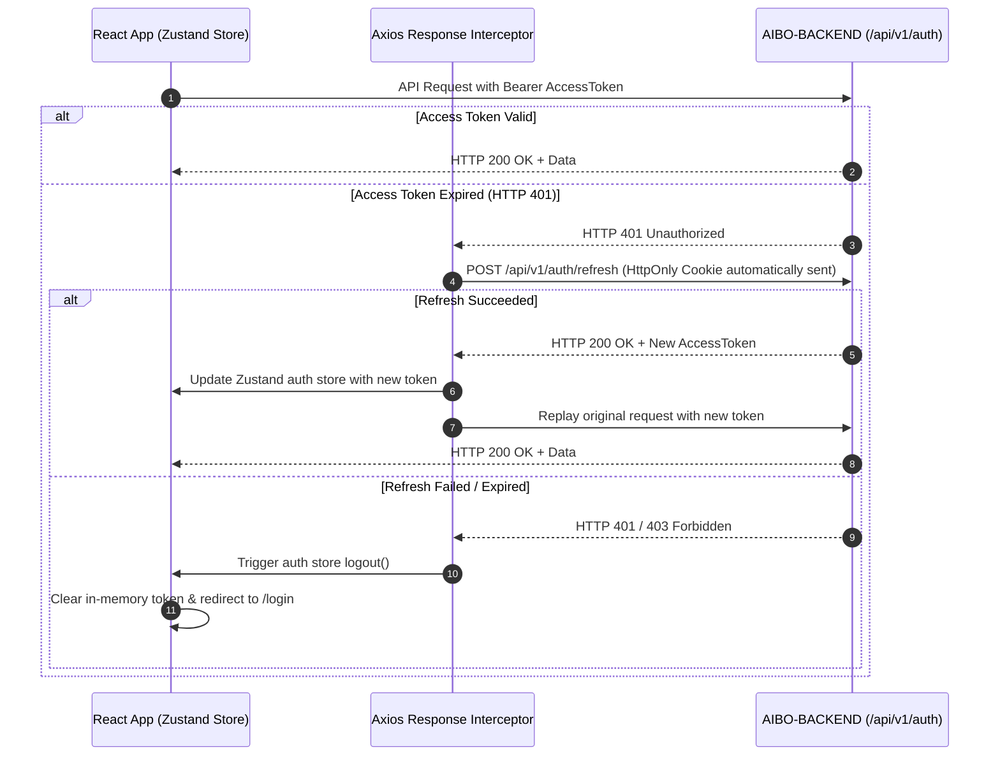

# Frontend State Management

`AIBO-FRONTEND` utilizes a hybrid state architecture combining **Zustand 5** for global client state, **React Context** for localized subtree state, and **Axios interceptors** for ephemeral server state.

---

## State Hierarchy

| State Scope | Technology | Storage Location | Examples |
| --- | --- | --- | --- |
| **Authentication & Session** | Zustand Auth Slice | Memory only (JS heap) | Current user profile, short-lived JWT access token, auth status. |
| **Global UI & Preferences** | Zustand UI/Theme Store | Memory + `localStorage` | Active theme (light/dark), sidebar collapsed/expanded, active modal states. |
| **Server State & Cache** | Feature API Modules | Ephemeral memory cache | Task lists, project boards, calendar schedules, notification feeds. |
| **Local Component State** | `useState`, `useReducer` | React Fiber tree | Form inputs, dropdown open/close, hover tooltips, drag coordinates. |

---

## Authentication Lifecycle & Token Storage

> [!CAUTION]
> **Zero Token Storage in Web Storage**: Short-lived JWT access tokens must **NEVER** be persisted to `localStorage` or `sessionStorage` to mitigate Cross-Site Scripting (XSS) token exfiltration risks.

---

## Cross-Tab Synchronization

- When a user logs out in one browser tab, a `BroadcastChannel` or `storage` event broadcast notifies all other open tabs.
- Sibling tabs immediately purge their in-memory token state and transition to the login route, preventing orphaned session activity.

---

## Optimistic UI Updates

Kanban board reordering and task completion toggles apply optimistic updates:
1. Dispatch local state mutation in the feature store/hook.
2. Fire asynchronous API request via `apiClient`.
3. If the request succeeds, commit final server timestamp/version.
4. If the request fails, rollback local state to the pre-action snapshot and trigger an error toast.
