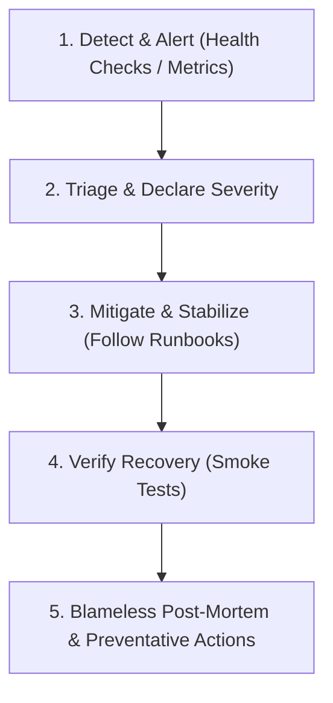

# Incident Response Governance

## Overview

This document defines incident classification, operational escalation, and post-mortem procedures for AIBO Assistant. Operational execution during active degradation is governed by the [V1.0 Incident Runbook](file:///c:/Projects/AIBO_ASSISTANT/docs/operations/V1.0_INCIDENT_RUNBOOK.md).

---

## Severity Levels

| Severity | Definition | Target Response (MTTA) | Target Mitigation (MTTR) | Examples |
| --- | --- | --- | --- | --- |
| **SEV 1** (Critical) | Total service outage, data corruption, active security breach, or total failure of confirmation gate. | < 15 minutes | < 1 hour | Complete backend outage, MongoDB replica set down, unauthorized task execution bypass. |
| **SEV 2** (Major) | Core workflows severely degraded without immediate workaround; provider outage without fallback. | < 30 minutes | < 4 hours | LLM Gateway failing with circuit breakers open; real-time Socket.io disconnects affecting all users. |
| **SEV 3** (Minor) | Partial degradation with viable workaround; non-critical feature unavailable. | < 2 hours | < 24 hours | Analytics charts failing to render, background notifications delayed, localized UI rendering bug. |
| **SEV 4** (Cosmetic) | Minor defect or cosmetic bug with minimal user impact. | < 24 hours | Next sprint | Typo in UI label, minor margin discrepancy on mobile viewports. |

---

## Incident Response Lifecycle

1. **Detection & Triage**: Alerts trigger via `/api/v1/health/ready`, elevated 5xx rate, or provider timeouts. Incident commander declares severity and notifies stakeholders.
2. **Mitigation First**: Priority is stabilizing user impact before diagnosing root cause. Common playbooks:
   - *Provider Outage*: Flip `PRIMARY_LLM_PROVIDER` to `ollama` or fallback provider.
   - *Regression on Deploy*: Execute [`V1.0_PRODUCTION_ROLLBACK_RUNBOOK.md`](file:///c:/Projects/AIBO_ASSISTANT/docs/operations/V1.0_PRODUCTION_ROLLBACK_RUNBOOK.md).
   - *Database Saturation*: Restart stuck connections or scale replica set read preferences.
3. **Verification**: Execute non-destructive smoke suite (`scripts/phase11_smoke.ps1`) to confirm all user flows function normally.
4. **Post-Mortem**: Document root cause, timeline, contributing factors, and preventative action items within 48 hours. Post-mortems are blameless and focus on structural safeguards.
