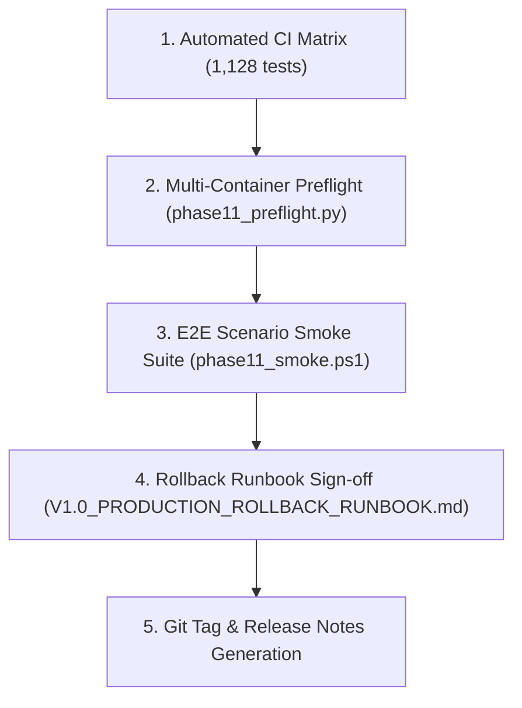

# Release Process Standards

This document establishes the release qualification procedure, release tagging discipline, and operational promotion gates for AIBO Assistant.

---

## Semantic Versioning Discipline

All repositories adhere to Semantic Versioning (`MAJOR.MINOR.PATCH`):

- **`MAJOR`**: Breaking API changes (e.g., changes to `/api/v1/` request/response envelopes or `POST /orchestrate` contract), database model breaking migrations, or authentication protocol revisions.
- **`MINOR`**: Backward-compatible new capabilities (e.g., adding LLM provider options, adding Kanban column filters, new analytical charts).
- **`PATCH`**: Backward-compatible bug fixes, security patches, performance improvements, and documentation updates.

---

## Release Candidate Qualification Gates

Before any version is tagged as a Release Candidate (`vX.Y.Z-rcN`) or promoted to production:

1. **Automated Verification**: Complete passing suite of 1,128 tests:
   - Backend unit/integration: 343 tests
   - Cross-repo E2E scenarios: 92 tests
   - Frontend components: 87 tests
   - Engine cognitive suite: 606 tests
2. **Environment Preflight**: Execute `python scripts/phase11_preflight.py` to validate container configurations, network boundaries, and variable schemas.
3. **Smoke Execution**: Run `scripts/phase11_smoke.ps1` against a candidate staging cluster to verify end-to-end user flows without state corruption.
4. **Rollback Review**: Confirm that database changes are backward-compatible and rollback steps in [`docs/operations/V1.0_PRODUCTION_ROLLBACK_RUNBOOK.md`](file:///c:/Projects/AIBO_ASSISTANT/docs/operations/V1.0_PRODUCTION_ROLLBACK_RUNBOOK.md) are executable.

---

## Release Notes Specification

Every release tag MUST publish release notes using [`templates/release-notes-template.md`](file:///c:/Projects/AIBO_ASSISTANT/.github/templates/release-notes-template.md) containing:
- Executive Summary & Version Identifiers
- Affected Sub-Repositories (`AIBO-BACKEND`, `AIBO-FRONTEND`, `AIBO-ENGINE-V1.0`, `.github`)
- User-Facing Features & Bug Fixes
- API & Contract Modifications
- Database Schema Changes
- Security & Dependency Updates
- Rollback & Verification Procedures
