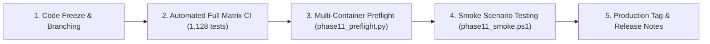

# Release Governance

## Semantic Versioning Strategy

AIBO Assistant enforces strict Semantic Versioning (`MAJOR.MINOR.PATCH`) across all sub-repositories and root coordination artifacts:

- **`MAJOR` (e.g., 2.0.0)**: Breaking API protocol changes (e.g., changing `POST /orchestrate` request/response envelope schemas), major database model changes requiring data migration, or complete architectural shifts.
- **`MINOR` (e.g., 1.1.0)**: Backward-compatible functionality additions (e.g., adding a new LLM provider to the Cognitive Gateway, adding new NLU intent slots, adding new dashboard analytics).
- **`PATCH` (e.g., 1.0.1)**: Backward-compatible bug fixes, security patches, performance optimizations, and documentation clarifications.

---

## Release Candidate (RC) Lifecycle

1. **Feature Freeze**: Changes are merged into `main` after passing branch protection status checks.
2. **Automated Verification**: Complete test matrix executes:
   - Backend unit and integration tests (343 tests)
   - Cross-repo E2E scenarios (92 scenarios)
   - Frontend Vitest components (87 tests)
   - Engine Pytest suite (606 tests)
3. **Preflight Audit**: Release engineers run `python scripts/phase11_preflight.py` to verify container configurations, environment variables, and network topologies.
4. **Smoke Scenario Execution**: Automated smoke testing runs `scripts/phase11_smoke.ps1` against a candidate staging cluster to verify end-to-end user workflows without state corruption.
5. **Tagging & Documentation**: Release tags (`v1.0.0`, etc.) are minted with corresponding release notes formatted according to [`templates/release-notes-template.md`](file:///c:/Projects/AIBO_ASSISTANT/.github/templates/release-notes-template.md).

---

## Rollback Readiness Requirement

No release may be deployed to production without an established rollback plan matching [`docs/operations/V1.0_PRODUCTION_ROLLBACK_RUNBOOK.md`](file:///c:/Projects/AIBO_ASSISTANT/docs/operations/V1.0_PRODUCTION_ROLLBACK_RUNBOOK.md). Database schema changes must remain backward-compatible with N-1 software versions to permit instantaneous rollback without data loss.
